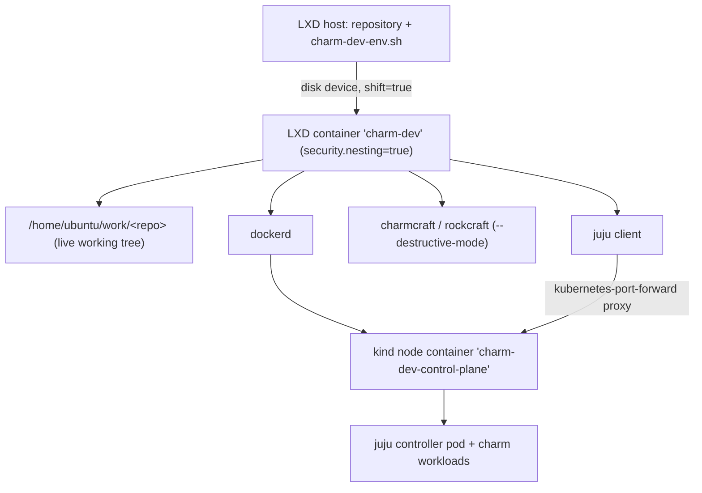

# Charm Development Environment

The charm testing environment is a single **nested LXD container** holding
Docker, a [kind](https://kind.sigs.k8s.io/) Kubernetes cluster, a bootstrapped
Juju controller, and the Charmcraft/Rockcraft toolchain. It is disposable: throw
it away and rebuild in minutes.

`scripts/charm-dev-env.sh` creates and manages it, and runs **on the LXD host**
alongside the checked-out repository, which it bind-mounts into the container.



## Setup

The repository lives on the LXD host, and the script runs there:

```bash
./scripts/charm-dev-env.sh create
```

`create` bind-mounts the repository into the container at
`/home/ubuntu/work/<repo-name>` and is idempotent and self-healing: run it again
after a host reboot, a half-finished build, or a cluster wipe. It re-verifies
every layer, re-attaches the mount, and re-bootstraps Juju when the stored
controller registration has gone stale.

The mount uses `shift=true`, so the container's `ubuntu` user and the host user
share ownership of the same files: edit on the host, build in the container, no
copy step in between.

Host prerequisites: LXD (tested on 6.9), the invoking user in the `lxd` group,
and `fs.inotify.max_user_watches >= 524288` / `max_user_instances >= 512` (the
script warns when they are too low).

## Commands

| Command | Effect |
| --- | --- |
| `create` | Create or repair container, mount, kind cluster, Juju controller |
| `status` | Container, project mount, Docker, kind, Kubernetes and Juju state |
| `exec <cmd…>` | Run a command as `ubuntu` in the mounted project directory |
| `shell` | Interactive shell as `ubuntu`, starting in the project directory |
| `mount [dir]` | Bind-mount another directory (default: this repository) |
| `stop` / `start` | Stop or start the container (the cluster survives) |
| `reset-cluster` | Delete and recreate the kind cluster and controller in place |
| `destroy` | Delete the container, profile and Docker volume |

Overridable: `CHARM_DEV_NAME`, `CHARM_DEV_IMAGE`, `CHARM_DEV_PROJECT`,
`KIND_VERSION`, `JUJU_CHANNEL`, `CHARM_DEV_CPUS`, `CHARM_DEV_MEMORY`,
`CHARM_DEV_DISK`, `CHARM_DEV_API_PORT`.

## Daily loop

Edit on the host; build and deploy in the container. `exec` already runs in the
mounted project directory.

```bash
# Build. Destructive mode builds in the container itself — no nested build VM —
# so artifacts land root-owned and must be chowned back before Juju reads them.
./scripts/charm-dev-env.sh exec "
  sudo charmcraft pack --destructive-mode --platform amd64 &&
  sudo chown ubuntu:ubuntu ./*.charm"

# Deploy and watch.
./scripts/charm-dev-env.sh exec "
  juju deploy ./verdaccio-k8s_amd64.charm --resource verdaccio-image=<image>"
./scripts/charm-dev-env.sh exec "juju status --color=false"
```

Rock → cluster, for a locally built workload image:

```bash
./scripts/charm-dev-env.sh exec "
  cd rock &&
  sudo rockcraft pack --destructive-mode &&
  sudo chown ubuntu:ubuntu ./*.rock &&
  sudo rockcraft.skopeo --insecure-policy copy \
    oci-archive:verdaccio_1.0_amd64.rock docker-daemon:verdaccio:1.0 &&
  kind load docker-image verdaccio:1.0 --name charm-dev"
```

Then deploy with `--resource verdaccio-image=verdaccio:1.0`. Use a real tag, not
`latest`: Juju sets `imagePullPolicy: Always` for `latest`, and the node would
try to pull a tag that exists only locally.

Destructive builds also leave `parts/`, `stage/` and `prime/` root-owned in the
working tree (they are gitignored). Remove them with
`charmcraft clean --destructive-mode` or `sudo rm -rf`.

## Design notes

Each of these is a failure that was hit and diagnosed while building this
environment. Do not "simplify" them away.

**Nesting yes, unconfined AppArmor no.** The container needs
`security.nesting=true` so Docker can run inside it. The widely copied
microk8s-in-LXD profile also sets `raw.lxc: lxc.apparmor.profile=unconfined`;
that breaks `snapd`, which then sees a working AppArmor but cannot load
`snap-confine`'s profile (`Unable to replace "/usr/lib/snapd/snap-confine"`), so
every snap in the container fails to install. LXD's default namespaced profile
is what makes nested snapd work — leave it alone.

**`/var/lib/docker` gets its own `dir`-pool volume.** The host's LXD pool is ZFS.
Docker's `overlayfs` driver refuses a ZFS-backed rootfs and silently degrades to
`vfs`, which copies the whole image tree per layer. The script creates a `dir`
pool (host ext4) and mounts a volume at `/var/lib/docker`; `create` fails loudly
if Docker still lands on `vfs`.

**Charmcraft and Rockcraft run in `--destructive-mode`.** They normally build in
a managed LXD instance, which would be LXD inside LXD inside LXD. AppArmor
stacking does not reach that depth: the innermost container's `snapd` fails
exactly as above, even with `security.nesting=true` set on it, so
`charmcraft pack` dies with `Failed to enable snapd service`. Destructive mode
builds directly in the container — which is the disposable build environment
anyway — and is much faster (charm 28 s, rock 17 s). **Consequence:** the
container base must match the artifact's base. This container is Ubuntu 24.04,
so it builds `base: ubuntu@24.04` charms and rocks. For another base, create a
second container with `CHARM_DEV_NAME` and `CHARM_DEV_IMAGE`.

**`chown` build artifacts before `juju deploy`.** Destructive builds run under
`sudo`, so the `.charm`/`.rock` files are root-owned. The `juju` snap is strictly
confined and its `home` interface only grants access to files *owned by the
invoking user*, so deploying a root-owned charm fails with a bare
`permission denied`.

**Juju reaches the controller through a Kubernetes port-forward proxy.** The
controller service is a ClusterIP on `10.96.0.0/16`, which is not routable from
the container — kind's node is a Docker container with its own network
namespace. Juju handles this itself: bootstrap records
`proxy-config: {type: kubernetes-port-forward, api-host: https://127.0.0.1:6443}`
and tunnels through the Kubernetes API. No MetalLB, no static routes. Two
consequences: Juju only works **from inside the container**, and recreating the
cluster invalidates the stored registration (new cluster CA →
`x509: certificate signed by unknown authority`). `create` and `reset-cluster`
detect that and re-bootstrap. The kind API port is pinned to 6443 so the
endpoint stays predictable.

**Why not microk8s.** It was tried first and rejected. In an unprivileged LXD
container its kubelet dies on `open /dev/kmsg: operation not permitted` —
passing the host device through does not help, because the user namespace still
denies the open. Fixing it means `security.privileged=true` or the
`KubeletInUserNamespace` feature gate. kind needs neither: its node entrypoint
handles `/dev/kmsg` itself, and the cluster comes up unprivileged in ~60 s.

## Verified configuration

Built and exercised end to end on an LXD host running Ubuntu 26.04 (kernel 7.0,
LXD 6.9, 8 cores / 22 GB):

| Component | Version |
| --- | --- |
| Container base | `ubuntu:24.04`, 6 CPU / 12 GiB / 60 GiB |
| Docker | 29.1.3, `overlayfs` driver, cgroup v2 (systemd) |
| kind | v0.33.0, node image Kubernetes v1.37.0 |
| Juju | 3.6.27 (`3/stable`) |
| Charmcraft / Rockcraft | 4.4.1 / 1.20.0 |
| kubectl | 1.36.3 |

Proven paths: `charmcraft init --profile kubernetes` → `pack --destructive-mode`
→ `juju deploy` → unit `active`; `rockcraft pack --destructive-mode` →
`rockcraft.skopeo` → `kind load docker-image` → deploy of that image → unit
`active`; `stop`/`start` of the container with the cluster, controller and a
running application recovering on their own; `reset-cluster` followed by a clean
redeploy.

Rough timings: first `create` ≈5 min, repeat `create` ≈80 s, `reset-cluster`
≈2.5 min, deploy to `active` ≈25 s.
