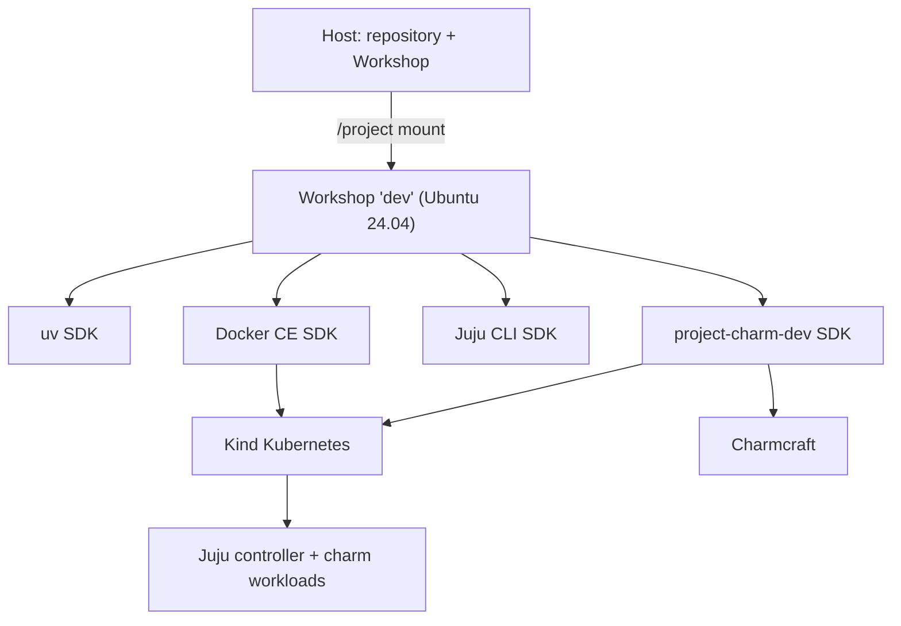

# Charm Development Workshop

The development environment is defined by `.workshop/dev.yaml`. Workshop
creates an Ubuntu 24.04 system container, mounts this repository at `/project`,
and installs the project SDKs. The supported `docker-ce` SDK supplies the
container runtime; [Kind](https://kind.sigs.k8s.io/) runs Kubernetes in Docker.



## Setup

Install Workshop and its LXD prerequisite on the host:

```bash
sudo snap install --channel=6/stable lxd
sudo snap install --classic workshop
```

Launch the checked-in definition from the repository root:

```bash
workshop launch dev
workshop run dev -- status
```

The first launch installs the `uv`, `docker-ce`, and `juju-cli` Store SDKs,
then the local `project-charm-dev` SDK. The local SDK installs Kind, kubectl,
Charmcraft; creates the `dev` Kind cluster with the checked-in
nested-container configuration; installs a local-path storage provisioner;
uses Juju's built-in `kind-dev` cloud; bootstraps the `dev` controller; and
selects its `dev` model.

`.workshop.lock` binds this checkout to its Workshop instance and is ignored by
Git. Keep it in place locally; do not copy it between checkouts.

## Lifecycle and commands

| Command | Effect |
| --- | --- |
| `workshop launch dev` | Build and start the environment for the first time |
| `workshop refresh dev` | Apply changes to the definition or SDK hooks |
| `workshop run dev -- status` | Show Docker, Kind nodes, and the current Juju model |
| `workshop run dev -- reset-cluster` | Replace Kind and bootstrap a fresh controller |
| `workshop exec dev -- <command…>` | Run a command in `/project` |
| `workshop shell dev` | Open an interactive shell in `/project` |
| `workshop stop dev` / `workshop start dev` | Stop or resume the environment |
| `workshop restore dev` | Discard runtime drift since the last successful refresh |
| `workshop remove dev` | Delete the environment but keep its definition |

`workshop launch` is a one-time operation. Use `workshop refresh` after editing
`.workshop/dev.yaml` or `.workshop/charm-dev/`.

## Daily loop

Run unit tests:

```bash
workshop exec dev -- uv run pytest
```

Pack the charm. The action runs as root because destructive-mode builds inside
the Workshop container, then restores ownership of the resulting artifact:

```bash
workshop run --uid 0 dev -- pack-charm
```

Deploy and inspect it as the normal `workshop` user:

```bash
workshop exec dev -- \
  juju deploy ./verdaccio-k8s_amd64.charm --resource verdaccio-image=<image>
workshop run dev -- status
```


Use an immutable tag or digest for the existing OCI image reference rather than
`latest`; pass the reference through the charm resource in the deploy command.

Destructive builds also leave `parts/`, `stage/`, and `prime/` root-owned in the
working tree. Clean them with Charmcraft in a root exec:

```bash
workshop exec --uid 0 dev -- charmcraft clean --destructive-mode
```

## Definition layout

- `.workshop/dev.yaml` selects the Ubuntu base and SDKs and defines the
  `status`, `reset-cluster`, and `pack-charm` actions.
- `.workshop/charm-dev/hooks/setup-base` installs Kind and the required snaps.
- `.workshop/charm-dev/kind.yaml` pins the Kubernetes node image and configures
  kubelet for the nested user namespace.
- `.workshop/charm-dev/hooks/setup-project` converges the local cluster and Juju
  controller whenever Workshop launches or refreshes the SDK.
- `.workshop/charm-dev/hooks/check-health` reports missing tools, an unavailable
  Kubernetes API, or a missing Juju controller to Workshop.
- `.workshop/charm-dev/bin/bootstrap` contains the idempotent Kind and Juju
  setup shared by launch, refresh, and `reset-cluster`.

The `juju-cli` SDK uses `latest/edge`, matching Canonical's current Workshop
examples. Its Juju state is attached through a persistent mount at
`/home/workshop/.local/share/juju`.

## Design constraints

**The Workshop base matches the charm.** Charmcraft runs with
`--destructive-mode`, so the build executes directly in the Ubuntu 24.04
Workshop container. Change the Workshop base together with the charm base.

**Root is limited to builds.** SDK installation hooks run as root by design.
Interactive commands, Docker, Kind, and Juju run as the `workshop` user. Only
the charm packing and cleaning commands use `workshop ... --uid 0`; the action
returns the charm artifact to `workshop:workshop`.

**Kind is pinned for nested ZFS.** Workshop's LXD root filesystem is ZFS.
Kubernetes 1.36 and newer use a cAdvisor filesystem plugin that cannot inspect
that nested dataset and prevents kubelet startup ([kubernetes#138556](https://github.com/kubernetes/kubernetes/issues/138556)).
`.workshop/charm-dev/kind.yaml` therefore pins the digest for Kubernetes 1.35.8
and enables `KubeletInUserNamespace`, which makes the unavailable `/dev/kmsg`
OOM watcher non-fatal. Change either setting only after verifying the complete
Workshop lifecycle against the replacement node image.

**Cluster setup is convergent.** Refreshes may rerun `setup-project`. The
bootstrap helper reuses a reachable `dev` controller, unregisters a stale
controller, and creates the `dev` model only when absent.

**Reset is explicit.** `workshop restore` reverts Workshop filesystem drift.
Use `reset-cluster` when the desired operation is to destroy Kind workload
state and bootstrap Juju again.

## Troubleshooting

Inspect a failed Workshop change:

```bash
workshop changes
workshop tasks
```

To keep the container available after a launch or refresh error:

```bash
workshop launch dev --wait-on-error
# fix or inspect the environment, then:
workshop launch dev --continue
# or roll back:
workshop launch dev --abort
```

Inspect the local cluster directly:

```bash
workshop exec dev -- docker info
workshop exec dev -- kind get clusters
workshop exec dev -- kubectl get pods --all-namespaces
```

For a completely clean rebuild:

```bash
workshop remove dev
workshop launch dev
```
